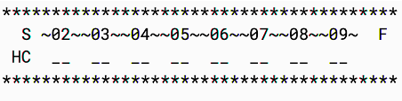

# Nature Trail Game using BlueJ
 
 
### Purpose
The purpose of this project was to write a program which allows a person to play Nature Trail Game against the computer, competing to gather the most points for animal sightings along a nature trail.

### Version 
18 April 2019

### How to Start
* Right-click on the Game class and select `new Game()` in order to create a new instance. 
* Right-click on the Game object created and select `void startGame()`. 

### Rules
* A player start with zero points and has a 50% chance of sighting an anymore when lading on a position. 
* As the player lands on a position with a nature feature, the player needs to follow an associated action.
* The first player who reaches the Finish point gets 10 points and the player with the highest points wins the game.

### User Instructions
* The Nature Trail game starts with a message. Following this, players can compete against each other by rolling a 4-sided dice and move forward. 
* The Nature Trail is represented by a line of space-separated underscores, where the letter 'S' and 'F' mean the Start and Finish positions. 
* Nature Trail representation: 
&nbsp;&nbsp;

